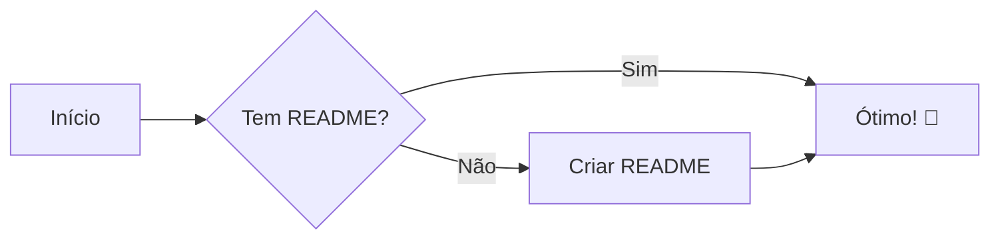
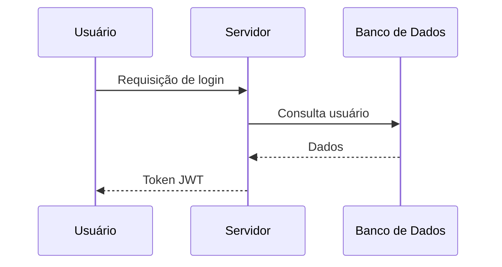
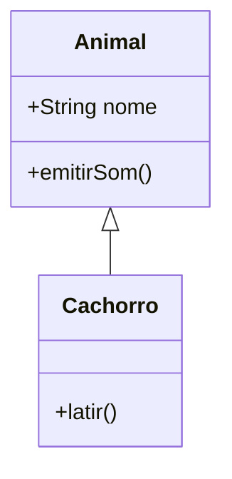
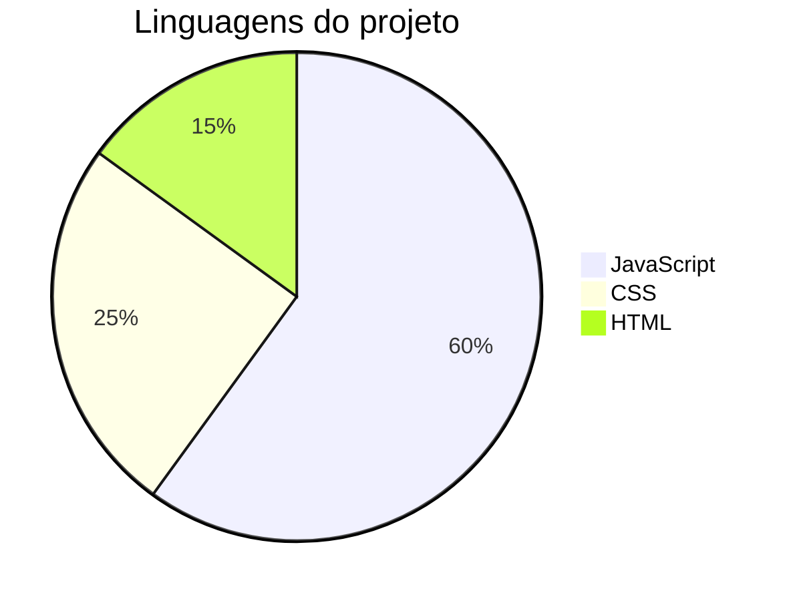
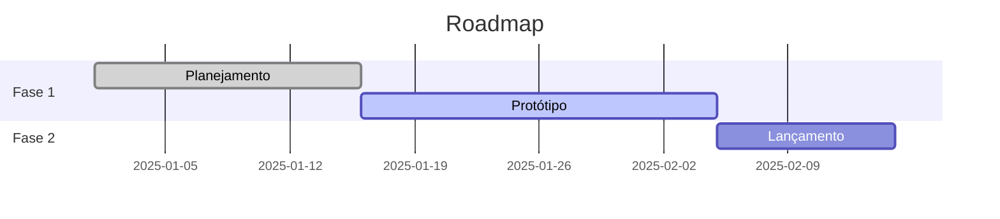

<div align="center">


### 📖 Aprenda a criar READMEs estruturados, bonitos e profissionais


</div>

---

> [!NOTE]
> Este arquivo é **ao mesmo tempo** um tutorial e um exemplo. Cada recurso aparece de duas formas: o **código** (o que você digita) e o **resultado** (como fica renderizado). Abra este arquivo no GitHub para ver tudo funcionando.

> [!TIP]
> Quer só o essencial? Vá direto para o [📋 Template pronto](#-template-pronto-para-copiar) e para os [🎨 Ícones e badges](#-ícones-e-badges-onde-pegar).

---

## 📚 Sumário

- [🧱 Anatomia de um bom README](#-anatomia-de-um-bom-readme)
- [✍️ Sintaxe básica](#️-sintaxe-básica)
- [🧩 Recursos intermediários](#-recursos-intermediários)
- [🚀 Recursos avançados](#-recursos-avançados)
- [🌐 HTML dentro do README](#-html-dentro-do-readme)
- [🎨 Ícones e badges: onde pegar](#-ícones-e-badges-onde-pegar)
- [📊 Diagramas, matemática e mapas](#-diagramas-matemática-e-mapas)
- [🙋 README de perfil do GitHub](#-readme-de-perfil-do-github)
- [📋 Template pronto para copiar](#-template-pronto-para-copiar)
- [✅ Checklist de um README excelente](#-checklist-de-um-readme-excelente)
- [🔗 Links úteis](#-links-úteis)

> [!IMPORTANT]
> **Como funcionam os links do sumário:** o GitHub gera a âncora do título em minúsculas, troca espaços por `-`, remove pontuação e **remove emojis** (deixando um `-` no início). Ex.: `## 🧱 Anatomia` vira `#-anatomia`.

---

## 🧱 Anatomia de um bom README

Um README é a **porta de entrada** do projeto. Quem chega deve entender em 30 segundos: *o que é, para que serve e como usar*.

### Estrutura recomendada

| # | Seção | Para que serve | Obrigatória? |
|:-:|-------|----------------|:------------:|
| 1 | **Título + descrição curta** | Dizer o que o projeto faz em 1–2 frases | ✅ |
| 2 | **Badges** | Mostrar status, versão, licença, build | ⭐ |
| 3 | **Demonstração** (print/GIF/vídeo) | Mostrar o projeto funcionando | ⭐ |
| 4 | **Sumário** | Navegar em READMEs longos | ⭐ (se longo) |
| 5 | **Funcionalidades** | Lista do que o projeto faz | ✅ |
| 6 | **Tecnologias** | Stack utilizada (com ícones) | ⭐ |
| 7 | **Pré-requisitos** | O que instalar antes | ✅ |
| 8 | **Instalação** | Passo a passo para rodar | ✅ |
| 9 | **Como usar** | Exemplos de uso | ✅ |
| 10 | **Estrutura de pastas** | Explicar a organização | ⭐ |
| 11 | **Roadmap** | O que vem por aí | ➖ |
| 12 | **Como contribuir** | Convidar e orientar colaboradores | ⭐ |
| 13 | **Licença** | Definir o que é permitido fazer | ✅ |
| 14 | **Autor / contato** | Quem fez e como falar | ⭐ |

> ✅ obrigatória · ⭐ recomendada · ➖ opcional

### Princípios de um README bonito

1. **Comece pelo mais importante** — o leitor não deve rolar a página para descobrir o que é o projeto.
2. **Mostre, não conte** — um GIF de 5 segundos vale mais que 3 parágrafos.
3. **Seja escaneável** — títulos, listas, tabelas e negrito nos pontos-chave.
4. **Seja consistente** — mesmo estilo de badges, mesmo tipo de ícone, mesma hierarquia de títulos.
5. **Não exagere** — ícones e badges são tempero, não o prato principal.
6. **Mantenha atualizado** — README desatualizado é pior que nenhum.

---

## ✍️ Sintaxe básica

### Títulos

````markdown
# Título 1 (use só um por README)
## Título 2
### Título 3
#### Título 4
##### Título 5
###### Título 6
````

# Título 1
## Título 2
### Título 3
#### Título 4
##### Título 5
###### Título 6

### Ênfase (negrito, itálico, riscado)

````markdown
**negrito**  ou  __negrito__
*itálico*    ou  _itálico_
***negrito e itálico***
~~riscado~~
**negrito com _itálico_ dentro**
````

**negrito** · *itálico* · ***negrito e itálico*** · ~~riscado~~ · **negrito com _itálico_ dentro**

### Parágrafos e quebras de linha

````markdown
Parágrafo 1 (deixe UMA linha em branco entre parágrafos).

Para quebrar a linha sem novo parágrafo, termine com dois espaços  
ou use a barra invertida\
ou use a tag <br>.
````

Para quebrar a linha sem novo parágrafo, termine com dois espaços  
ou use a barra invertida\
ou use a tag `<br>`.

### Listas

````markdown
- Item com hífen
- Outro item
  - Subitem (indente 2 espaços)
    - Sub-subitem

* Também funciona com asterisco
+ E com mais

1. Primeiro
2. Segundo
   1. Sub-passo 2.1
   2. Sub-passo 2.2
3. Terceiro
````

- Item com hífen
- Outro item
  - Subitem (indente 2 espaços)
    - Sub-subitem

1. Primeiro
2. Segundo
   1. Sub-passo 2.1
   2. Sub-passo 2.2
3. Terceiro

### Lista de tarefas (checklist)

````markdown
- [x] Tarefa concluída
- [ ] Tarefa pendente
- [ ] Outra pendente
  - [x] Subtarefa feita
````

- [x] Tarefa concluída
- [ ] Tarefa pendente
- [ ] Outra pendente
  - [x] Subtarefa feita

> 💡 No GitHub, em issues e PRs, essas caixas são clicáveis. No README, servem como roadmap visual.

### Links

````markdown
[Texto do link](https://github.com)
[Link com título ao passar o mouse](https://github.com "Título aqui")
<https://github.com>   ← link automático
[Link por referência][ref]
[Link para outro arquivo do repo](./docs/CONTRIBUTING.md)
[Link para uma seção deste README](#-sintaxe-básica)

[ref]: https://github.com
````

[Texto do link](https://github.com) · [Com título](https://github.com "Título aqui") · <https://github.com> · [Por referência][ref]

[ref]: https://github.com

### Imagens

````markdown


[](https://seusite.com)
````

> [!TIP]
> **Onde hospedar imagens?** (1) Na própria pasta do repositório, como `/assets` ou `/docs/img` (melhor opção, nunca quebra). (2) Arrastando a imagem para o campo de comentário de uma issue no GitHub — ele gera uma URL pronta (sem precisar enviar a issue). (3) Serviços externos como Imgur.
>
> **Sempre** preencha o texto alternativo: ajuda leitores de tela e aparece se a imagem falhar.

### Citações (blockquote)

````markdown
> Uma citação simples.
>
> > Citação aninhada.
>
> — *Autor*
````

> Uma citação simples.
>
> > Citação aninhada.
>
> — *Autor*

### Linha horizontal

````markdown
---
***
___
````

---

### Código inline e blocos de código

````markdown
Use `npm install` para instalar. ← código inline

```js
function ola(nome) {
  return `Olá, ${nome}!`;
}
```
````

Use `npm install` para instalar.

```js
function ola(nome) {
  return `Olá, ${nome}!`;
}
```

> 💡 **Sempre indique a linguagem** depois dos três crases (` ```js `, ` ```python `, ` ```bash `, ` ```json `, ` ```yaml `, ` ```diff `, ` ```sql `…). Isso ativa o realce de cores.

**Exemplos por linguagem:**

```bash
# Terminal: clone e rode o projeto
git clone https://github.com/usuario/projeto.git
cd projeto
npm install && npm start
```

```python
def soma(a: int, b: int) -> int:
    return a + b
```

```json
{
  "nome": "meu-projeto",
  "versao": "1.0.0"
}
```

**Bloco `diff`** (mostra o que foi adicionado/removido):

```diff
- linha removida (vermelho)
+ linha adicionada (verde)
  linha inalterada
```

### Tabelas

````markdown
| Coluna A | Coluna B | Coluna C |
|:---------|:--------:|---------:|
| esquerda | centro   | direita  |
| `código` | **bold** | [link](#) |
````

| Coluna A | Coluna B | Coluna C |
|:---------|:--------:|---------:|
| esquerda | centro   | direita  |
| `código` | **bold** | [link](#) |

> `:---` alinha à esquerda · `:---:` centraliza · `---:` alinha à direita. Dentro da célula, use `<br>` para quebrar linha e `\|` para escrever uma barra vertical.

### Caracteres de escape

````markdown
\*isto não fica em itálico\*
\# isto não vira título
\[isto não vira link\]
````

\*isto não fica em itálico\* · \# isto não vira título · \[isto não vira link\]

Caracteres que podem ser escapados com `\`: `` \ ` * _ { } [ ] ( ) # + - . ! | ``

### Comentários (invisíveis no resultado)

````markdown
<!-- Este texto só aparece no código-fonte. Ótimo para lembretes! -->
````

<!-- Você só vê isto no código-fonte 😉 -->

---

## 🧩 Recursos intermediários

### Emojis (via shortcode)

Digite `:nome:` e o GitHub converte em emoji.

````markdown
:rocket: :sparkles: :bug: :fire: :books: :wrench: :warning: :tada: :star: :bulb: :lock: :zap:
````

:rocket: :sparkles: :bug: :fire: :books: :wrench: :warning: :tada: :star: :bulb: :lock: :zap:

Você também pode **colar o emoji direto**: 🚀 ✨ 🐛 🔥 📚 🔧 ⚠️ 🎉 ⭐ 💡 🔒 ⚡

> 🔎 Lista completa dos shortcodes: [Emoji Cheat Sheet](https://github.com/ikatyang/emoji-cheat-sheet). Para copiar emojis: [Emojipedia](https://emojipedia.org) ou [Get Emoji](https://getemoji.com).

**Emojis úteis por seção (sugestão):**

| Seção | Emojis |
|-------|--------|
| Sobre / Descrição | 📖 📝 ℹ️ 💡 |
| Funcionalidades | ✨ 🚀 ⚡ 🎯 |
| Tecnologias | 🛠️ 💻 🧰 ⚙️ |
| Instalação | 📦 📥 🔧 ⬇️ |
| Uso | ▶️ 🕹️ 📌 |
| Estrutura | 📁 🗂️ 🌳 |
| Testes | 🧪 ✅ 🔍 |
| Contribuição | 🤝 💬 🍴 |
| Licença | 📄 ⚖️ 🔑 |
| Contato | 📫 📧 🌐 ☎️ |

### Alertas do GitHub (callouts coloridos)

````markdown
> [!NOTE]
> Informação útil que o leitor deve saber.

> [!TIP]
> Dica para fazer algo melhor.

> [!IMPORTANT]
> Informação crucial para ter sucesso.

> [!WARNING]
> Atenção: pode causar problemas.

> [!CAUTION]
> Perigo: consequências negativas graves.
````

> [!NOTE]
> Informação útil que o leitor deve saber.

> [!TIP]
> Dica para fazer algo melhor.

> [!IMPORTANT]
> Informação crucial para ter sucesso.

> [!WARNING]
> Atenção: pode causar problemas.

> [!CAUTION]
> Perigo: consequências negativas graves.

### Seções recolhíveis (`<details>`)

Ótimo para esconder conteúdo longo (logs, listas grandes, FAQs).

````markdown
<details>
<summary>Clique para expandir</summary>

Conteúdo escondido. **Markdown funciona aqui**, mas deixe uma
linha em branco depois do `<summary>`.

```bash
echo "código também funciona"
```

</details>
````

<details>
<summary>Clique para expandir</summary>

Conteúdo escondido. **Markdown funciona aqui**, mas deixe uma
linha em branco depois do `<summary>`.

```bash
echo "código também funciona"
```

</details>

Para começar **já aberto**, use `<details open>`.

### Notas de rodapé

````markdown
Aqui vai uma afirmação que precisa de fonte.[^1] E outra nota.[^nota]

[^1]: Esta é a primeira nota de rodapé.
[^nota]: Notas podem ter nomes e vários parágrafos.
````

Aqui vai uma afirmação que precisa de fonte.[^1] E outra nota.[^nota]

[^1]: Esta é a primeira nota de rodapé.
[^nota]: Notas podem ter nomes e vários parágrafos.

### Teclas, subscrito, sobrescrito e destaque

````markdown
Pressione <kbd>Ctrl</kbd> + <kbd>C</kbd> para copiar.
H<sub>2</sub>O e E = mc<sup>2</sup>
<ins>texto sublinhado</ins>
<mark>texto destacado</mark>  (nem sempre renderiza no GitHub)
````

Pressione <kbd>Ctrl</kbd> + <kbd>C</kbd> para copiar. · H<sub>2</sub>O e E = mc<sup>2</sup> · <ins>texto sublinhado</ins>

### Amostras de cor

````markdown
`#0969DA`  `#8250DF`  `rgb(9,105,218)`  `hsl(212,92%,45%)`
````

`#0969DA` · `#8250DF` · `rgb(9,105,218)` · `hsl(212,92%,45%)`

> O GitHub mostra um círculo colorido ao lado de códigos de cor dentro de crases (apenas em issues/PRs/comentários e, em alguns casos, em READMEs).

### Árvore de pastas (estrutura do projeto)

Gere com o comando `tree` (Linux/macOS, ou `tree /F` no Windows) e cole num bloco de código:

````markdown
```text
meu-projeto/
├── 📁 src/
│   ├── 📁 components/
│   │   └── Button.jsx
│   ├── 📁 utils/
│   └── index.js
├── 📁 docs/
├── 📁 assets/
│   └── logo.png
├── .gitignore
├── LICENSE
├── package.json
└── README.md
```
````

```text
meu-projeto/
├── 📁 src/
│   ├── 📁 components/
│   │   └── Button.jsx
│   ├── 📁 utils/
│   └── index.js
├── 📁 docs/
├── 📁 assets/
│   └── logo.png
├── .gitignore
├── LICENSE
├── package.json
└── README.md
```

### Menções e referências (funcionam em issues/PRs; em READMEs viram links)

| Digite | Resultado |
|--------|-----------|
| `@usuario` | Menciona/linka um usuário |
| `#123` | Linka a issue ou PR nº 123 |
| `usuario/repo#123` | Linka issue de outro repositório |
| SHA do commit (`a5c3785`) | Linka o commit |

### Link permanente para trecho de código

No GitHub, abra um arquivo, clique no número da linha (ou shift+clique para um intervalo), aperte <kbd>Y</kbd> para fixar o commit e cole a URL numa linha sozinha. O GitHub exibe o trecho do código automaticamente:

````markdown
https://github.com/usuario/repo/blob/COMMIT_SHA/src/index.js#L10-L20
````

---

## 🚀 Recursos avançados

### Imagens diferentes para tema claro e escuro

Muitos usuários usam o GitHub no modo escuro. Use `<picture>` para servir a imagem certa:

````html
<picture>
  <source media="(prefers-color-scheme: dark)" srcset="./assets/logo-dark.png">
  <source media="(prefers-color-scheme: light)" srcset="./assets/logo-light.png">
  
</picture>
````

Alternativa simples (funciona no GitHub):

````markdown


````

### Vídeos

- **Upload direto:** arraste um `.mp4` / `.mov` para o editor do README no GitHub; ele gera um link e incorpora um player.
- **YouTube:** o GitHub não incorpora iframes. O truque é usar uma miniatura clicável:

````markdown
[](https://www.youtube.com/watch?v=ID_DO_VIDEO)
````

- **GIFs:** ideais para demonstrar o projeto. Grave a tela com [ScreenToGif](https://www.screentogif.com) (Windows), [LICEcap](https://www.cockos.com/licecap/) (Windows/macOS) ou [Peek](https://github.com/phw/peek) (Linux). Mantenha abaixo de ~5 MB.

### Botões e links estilizados (com badges)

````markdown
[](https://seusite.com)
[](https://docs.seusite.com)
````

[](https://github.com)
[](https://github.com)

### Botão "Voltar ao topo"

````markdown
<p align="right">(<a href="#readme-top">voltar ao topo</a>)</p>
````

Para isso funcionar, coloque no início do README a âncora: `<a id="readme-top"></a>`

<a id="readme-top"></a>

<p align="right">(<a href="#readme-top">voltar ao topo</a>)</p>

### Contribuidores automáticos

````markdown
<a href="https://github.com/USUARIO/REPO/graphs/contributors">
  
</a>
````

### Histórico de estrelas

````markdown
[](https://star-history.com/#USUARIO/REPO&Date)
````

---

## 🌐 HTML dentro do README

O GitHub aceita **um subconjunto seguro de HTML**. Isso permite o que o Markdown puro não faz: centralizar, redimensionar, alinhar lado a lado.

### Centralizar conteúdo

````html
<div align="center">

# Título Centralizado

Descrição centralizada

</div>
````

> ⚠️ Deixe **linhas em branco** dentro do `<div>` para o Markdown continuar funcionando lá dentro.

### Redimensionar imagem

````html


````

### Imagens lado a lado

````html
<p align="center">
  
  
</p>
````

### Tabela HTML (mais controle que a de Markdown)

````html
<table>
  <tr>
    <td align="center"><b>Coluna 1</b></td>
    <td align="center"><b>Coluna 2</b></td>
  </tr>
  <tr>
    <td>Texto</td>
    <td>Outro texto</td>
  </tr>
</table>
````

<table>
  <tr>
    <td align="center"><b>Coluna 1</b></td>
    <td align="center"><b>Coluna 2</b></td>
  </tr>
  <tr>
    <td>Texto</td>
    <td>Outro texto</td>
  </tr>
</table>

### Tags HTML permitidas mais úteis

`<div>` `<p>` `<br>` `<hr>` `<h1>`–`<h6>` `` `<a>` `<b>` `<i>` `<em>` `<strong>` `<code>` `<pre>` `<kbd>` `<sub>` `<sup>` `<ins>` `<del>` `<details>` `<summary>` `<table>` `<tr>` `<td>` `<th>` `<ul>` `<ol>` `<li>` `<blockquote>` `<picture>` `<source>`

> [!WARNING]
> **Não funcionam no GitHub:** `<style>`, `<script>`, `<iframe>`, atributo `style="..."`, `class`, JavaScript e fontes externas. Esses elementos são removidos por segurança. Cores e tamanhos só via atributos simples (`width`, `align`) ou via imagens/badges.

---

## 🎨 Ícones e badges: onde pegar

Esta é a seção que mais faz o README "brilhar". Existem **3 tipos de recurso visual**: *emojis*, *badges* e *ícones de tecnologia*.

### 1️⃣ Badges com Shields.io (o mais popular)

🔗 **Site:** [shields.io](https://shields.io)

Gera etiquetas coloridas. Formato básico:

````text
https://img.shields.io/badge/ROTULO-MENSAGEM-COR
````

````markdown

````

**Estilos** (parâmetro `style=`):

| Estilo | Exemplo |
|--------|---------|
| `flat` (padrão) |  |
| `flat-square` |  |
| `plastic` |  |
| `for-the-badge` |  |
| `social` |  |

**Badges dinâmicos** (atualizam sozinhos, trocando `USUARIO/REPO`):

````markdown


````

Exemplo ao vivo:


**Parâmetros úteis:** `?style=for-the-badge` · `&logo=NOME` · `&logoColor=white` · `&labelColor=black` · `&color=blueviolet`

### 2️⃣ Ícones de tecnologias

| Recurso | Site | Como usar |
|---------|------|-----------|
| 🥇 **Skill Icons** | [skillicons.dev](https://skillicons.dev) | Uma linha gera vários ícones lado a lado |
| **Devicon** | [devicon.dev](https://devicon.dev) | Ícones SVG de linguagens/ferramentas |
| **Simple Icons** | [simpleicons.org](https://simpleicons.org) | +3000 logos de marcas (o "nome" do ícone é usado no `logo=` do Shields) |
| **Markdown Badges** | [github.com/Ileriayo/markdown-badges](https://github.com/Ileriayo/markdown-badges) | Coleção de badges prontos para copiar/colar |
| **Tech Stack Generator** | [github.com/tandpfun/skill-icons](https://github.com/tandpfun/skill-icons) | Repositório do Skill Icons, com lista de todos os nomes |

#### 🥇 Skill Icons (o mais fácil)

````markdown
[](https://skillicons.dev)
````

[](https://skillicons.dev)

- `i=` → lista de ícones separados por vírgula
- `perline=` → quantos por linha
- `theme=light` ou `theme=dark` → cor de fundo
- Sufixos `-light` / `-dark` em alguns ícones (ex.: `github-light`)

#### Badges de tecnologia com logo (Shields + Simple Icons)

````markdown


````


> 💡 **Receita:** `https://img.shields.io/badge/NOME-COR_HEX_SEM_#?style=for-the-badge&logo=NOME_NO_SIMPLEICONS&logoColor=white`
> Pegue o **nome do logo** e a **cor oficial** em [simpleicons.org](https://simpleicons.org).

#### Ícones Devicon (via CDN, como imagem)

````markdown


````


### 3️⃣ Emojis como ícones

Não precisam de link, é só copiar e colar de [Emojipedia](https://emojipedia.org) ou [Get Emoji](https://getemoji.com). São a forma mais leve de dar identidade às seções.

### 4️⃣ Redes sociais e contato

````markdown
[](https://linkedin.com/in/SEU_USUARIO)
[](https://instagram.com/SEU_USUARIO)
[](https://x.com/SEU_USUARIO)
[](https://youtube.com/@SEU_CANAL)
[](mailto:seu@email.com)
[](https://wa.me/5571999999999)
[](https://seusite.com)
````

[](https://linkedin.com)
[](https://instagram.com)
[](https://x.com)
[](https://youtube.com)
[](mailto:seu@email.com)
[](https://wa.me/5571999999999)

### 5️⃣ Banners, cabeçalhos e efeitos

| Recurso | Site | O que faz |
|---------|------|-----------|
| **Capsule Render** | [github.com/kyechan99/capsule-render](https://github.com/kyechan99/capsule-render) | Banners com ondas, gradientes e textos (usado no topo deste arquivo) |
| **Readme Typing SVG** | [github.com/DenverCoder1/readme-typing-svg](https://github.com/DenverCoder1/readme-typing-svg) | Texto que "digita" sozinho |
| **GitHub Readme Stats** | [github.com/anuraghazra/github-readme-stats](https://github.com/anuraghazra/github-readme-stats) | Cartões com suas estatísticas do GitHub |
| **GitHub Profile Trophy** | [github.com/ryo-ma/github-profile-trophy](https://github.com/ryo-ma/github-profile-trophy) | Troféus de conquistas |
| **Snake (snk)** | [github.com/Platane/snk](https://github.com/Platane/snk) | Cobrinha comendo seu gráfico de contribuições |
| **Contrib Rocks** | [contrib.rocks](https://contrib.rocks) | Avatares dos contribuidores |
| **Star History** | [star-history.com](https://star-history.com) | Gráfico de estrelas ao longo do tempo |

Exemplo de texto digitando:

````markdown
[](https://git.io/typing-svg)
````

### 6️⃣ Ilustrações e imagens gratuitas

- [unDraw](https://undraw.co) — ilustrações SVG personalizáveis
- [Storyset](https://storyset.com) — ilustrações animadas
- [Flaticon](https://www.flaticon.com) — ícones (verifique a licença/atribuição)
- [Icons8](https://icons8.com) — ícones e ilustrações
- [Unsplash](https://unsplash.com) — fotos gratuitas
- [Carbon](https://carbon.now.sh) — transforma código em imagens bonitas
- [Figma](https://figma.com) / [Canva](https://canva.com) — criar banners e logos

> [!CAUTION]
> **Font Awesome, Material Icons e Bootstrap Icons NÃO funcionam** diretamente no README, pois dependem de CSS/fontes externas, que o GitHub bloqueia. Use a versão em **imagem SVG** (baixe o arquivo e coloque em `/assets`) ou use as alternativas acima.

---

## 📊 Diagramas, matemática e mapas

### Diagramas com Mermaid

O GitHub renderiza diagramas escritos em texto:

````markdown

````


**Diagrama de sequência:**



**Diagrama de classes:**



**Gráfico de pizza:**



**Linha do tempo (Gantt):**



> 📚 Documentação e mais tipos de diagrama: [mermaid.js.org](https://mermaid.js.org) · Editor online: [mermaid.live](https://mermaid.live)

### Fórmulas matemáticas (LaTeX)

````markdown
Inline: $\sqrt{3x-1}+(1+x)^2$

Bloco:
$$
\left( \sum_{k=1}^n a_k b_k \right)^2 \leq \left( \sum_{k=1}^n a_k^2 \right) \left( \sum_{k=1}^n b_k^2 \right)
$$
````

Inline: $\sqrt{3x-1}+(1+x)^2$

Bloco:

$$
\left( \sum_{k=1}^n a_k b_k \right)^2 \leq \left( \sum_{k=1}^n a_k^2 \right) \left( \sum_{k=1}^n b_k^2 \right)
$$

### Mapas (GeoJSON / TopoJSON)

````markdown
```geojson
{
  "type": "Feature",
  "geometry": { "type": "Point", "coordinates": [-38.32, -12.70] },
  "properties": { "name": "Camaçari, BA" }
}
```
````

```geojson
{
  "type": "Feature",
  "geometry": { "type": "Point", "coordinates": [-38.32, -12.70] },
  "properties": { "name": "Camaçari, BA" }
}
```

### Modelos 3D (STL)

Um bloco ` ```stl ` com o conteúdo ASCII de um arquivo `.stl` é renderizado como modelo 3D interativo. Você também pode **linkar** um arquivo `.stl` do repositório e o GitHub o exibirá no visualizador 3D.

---

## 🙋 README de perfil do GitHub

O GitHub tem um README **especial** que aparece na página do seu perfil.

### Como criar

1. Crie um repositório **público** com o **mesmo nome do seu usuário** (ex.: `joaosilva/joaosilva`).
2. Marque a opção **"Add a README file"**.
3. Edite o `README.md` — ele aparece no topo do seu perfil.

### Modelo de perfil

````markdown
<div align="center">

# Olá, eu sou o João 👋

[](https://git.io/typing-svg)


</div>

## 🛠️ Tecnologias
[](https://skillicons.dev)

## 📊 Estatísticas
<p align="center">
  
  
</p>

## 📫 Contato
[](https://linkedin.com/in/SEU_USUARIO)
````

> 💡 Mais inspiração: [awesome-github-profile-readme](https://github.com/abhisheknaiidu/awesome-github-profile-readme) · Gerador visual: [rahuldkjain/github-profile-readme-generator](https://github.com/rahuldkjain/github-profile-readme-generator)

---

## 📋 Template pronto para copiar

Copie o bloco abaixo, cole no seu `README.md` e substitua os textos em `MAIÚSCULAS`.

````markdown
<a id="readme-top"></a>

<div align="center">


# NOME DO PROJETO

**Descrição curta e impactante do que o projeto faz.**


[Ver Demo](https://seusite.com) · [Reportar Bug](https://github.com/USUARIO/REPO/issues) · [Sugerir Funcionalidade](https://github.com/USUARIO/REPO/issues)

</div>

---

## 📚 Sumário
- [Sobre](#-sobre-o-projeto)
- [Demonstração](#-demonstração)
- [Funcionalidades](#-funcionalidades)
- [Tecnologias](#️-tecnologias)
- [Começando](#-começando)
- [Como usar](#-como-usar)
- [Estrutura](#-estrutura-de-pastas)
- [Roadmap](#️-roadmap)
- [Contribuindo](#-contribuindo)
- [Licença](#-licença)
- [Contato](#-contato)

## 📖 Sobre o projeto
Explique o **problema** que resolve, para **quem** e **por que** é diferente.

## 🎬 Demonstração


## ✨ Funcionalidades
- [x] Funcionalidade 1
- [x] Funcionalidade 2
- [ ] Funcionalidade futura

## 🛠️ Tecnologias
[](https://skillicons.dev)

## 🚀 Começando

### Pré-requisitos
- [Node.js](https://nodejs.org) v18+
- [Git](https://git-scm.com)

### Instalação
```bash
# 1. Clone o repositório
git clone https://github.com/USUARIO/REPO.git

# 2. Entre na pasta
cd REPO

# 3. Instale as dependências
npm install

# 4. Configure as variáveis de ambiente
cp .env.example .env

# 5. Rode o projeto
npm run dev
```

> [!NOTE]
> Acesse `http://localhost:3000` no navegador.

## 💻 Como usar
```js
import { minhaFuncao } from 'meu-projeto';
minhaFuncao('exemplo');
```

## 📁 Estrutura de pastas
```text
projeto/
├── src/
├── docs/
└── README.md
```

## 🗺️ Roadmap
- [x] Versão inicial
- [ ] Autenticação
- [ ] Modo escuro

## 🤝 Contribuindo
1. Faça um **fork** do projeto
2. Crie sua branch: `git checkout -b feature/minha-feature`
3. Commit: `git commit -m "feat: adiciona minha feature"`
4. Push: `git push origin feature/minha-feature`
5. Abra um **Pull Request**

## 📄 Licença
Distribuído sob a licença MIT. Veja [`LICENSE`](./LICENSE) para mais informações.

## 📫 Contato
**Seu Nome** — [@seu_usuario](https://github.com/seu_usuario) — seu@email.com

<p align="right">(<a href="#readme-top">voltar ao topo</a>)</p>
````

---

## ✅ Checklist de um README excelente

**Conteúdo**
- [ ] O título e a descrição explicam o projeto em até 2 frases
- [ ] Há uma imagem, GIF ou vídeo mostrando o projeto
- [ ] Os pré-requisitos estão listados com versões
- [ ] A instalação funciona **copiando e colando** os comandos
- [ ] Há pelo menos um exemplo de uso
- [ ] A licença está declarada (e existe o arquivo `LICENSE`)
- [ ] Há forma de contato ou de reportar problemas

**Formatação**
- [ ] Só existe **um** `# Título 1`
- [ ] Hierarquia de títulos sem "pulos" (`##` → `###`, não `##` → `####`)
- [ ] Todos os blocos de código têm a linguagem indicada
- [ ] Todas as imagens têm texto alternativo (`alt`)
- [ ] Links testados (nenhum quebrado)
- [ ] Sumário presente se o README passa de ~4 rolagens de tela
- [ ] Testado no **modo claro e escuro** do GitHub

**Estilo**
- [ ] Ícones/badges consistentes (mesmo `style=`)
- [ ] Nada de excesso: cada elemento visual tem função
- [ ] Linguagem clara, sem jargão desnecessário
- [ ] Sem informação desatualizada

---

## 🔗 Links úteis

| Categoria | Recurso |
|-----------|---------|
| 📘 Guia oficial | [GitHub Docs: Sintaxe básica de escrita e formatação](https://docs.github.com/pt/get-started/writing-on-github/getting-started-with-writing-and-formatting-on-github/basic-writing-and-formatting-syntax) |
| 📘 Guia oficial | [GitHub Docs: Sobre READMEs](https://docs.github.com/pt/repositories/managing-your-repositorys-settings-and-features/customizing-your-repository/about-readmes) |
| 📗 Tutorial | [Make a README](https://www.makeareadme.com) |
| 📗 Cheatsheet | [Markdown Guide](https://www.markdownguide.org/cheat-sheet/) |
| 🛠️ Editor visual | [readme.so](https://readme.so) — monte o README arrastando seções |
| 🛠️ Editor online | [StackEdit](https://stackedit.io) · [Dillinger](https://dillinger.io) |
| ✨ Inspiração | [Awesome README](https://github.com/matiassingers/awesome-readme) |
| ✨ Inspiração | [Best-README-Template](https://github.com/othneildrew/Best-README-Template) |
| 🎨 Badges | [Shields.io](https://shields.io) · [Markdown Badges](https://github.com/Ileriayo/markdown-badges) |
| 🎨 Ícones | [Skill Icons](https://skillicons.dev) · [Devicon](https://devicon.dev) · [Simple Icons](https://simpleicons.org) |
| 😀 Emojis | [Emoji Cheat Sheet](https://github.com/ikatyang/emoji-cheat-sheet) · [Emojipedia](https://emojipedia.org) |
| ⚖️ Licenças | [Choose a License](https://choosealicense.com) |
| 📝 Changelog | [Keep a Changelog](https://keepachangelog.com/pt-BR/) |
| 💬 Commits | [Conventional Commits](https://www.conventionalcommits.org/pt-br/) |
| 🤝 Código de conduta | [Contributor Covenant](https://www.contributor-covenant.org/pt-br/) |
| 👥 Contribuidores | [All Contributors](https://allcontributors.org) |

---

<div align="center">

### 🎉 Pronto! Agora é só praticar.

**Dica final:** abra o README dos seus projetos favoritos no GitHub, clique em **"Raw"** e veja como foi escrito. É a melhor escola.

Feito com ❤️ e muito Markdown


</div>